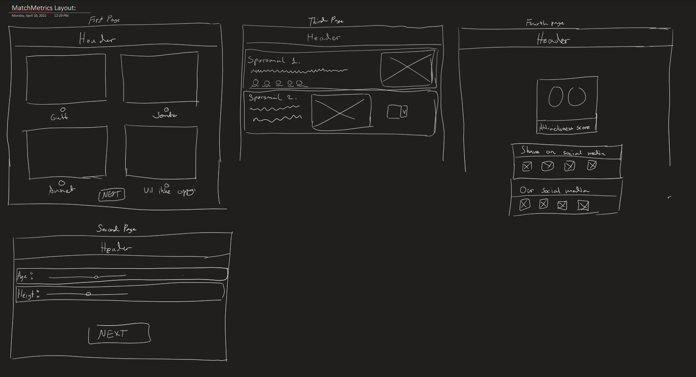

# Matchmetrics
### Laget av Jonatan Roland
### ___________________________
## Beskrivelse
Matchmetrics er en app som skal gi den en score på hvor attraktiv du er. Du skal svare på 10 spørsmål som skal styrer hvilken score du får.

 Du starter med å velge kjønn. Det endrer bakgrunnsfargen slik at det føles mer interaktivt og personalisert for brukeren.

 Deretter svarer du på noen brukeropplysninger. Der legger du inn navn, alder, høyde og burdagsmåned. 

 Så får du utdelt 10 spørsmål som går ut på preferanser og hva du liker. Dette er i hovedsak det som styrer scoren din.

 Til slutt får du en box med scoren din i prosent. Du får også en melding. Denne boksen kan du dele, og vise andre at dette er deg, og du har en "den" scoren. 

 ps. Poengene man får er basert på hva kjæresten min svarte på spørsmålene. 


## Wireframes



## Design
Underveis har jeg gjort noen endringer til planen. Jeg skulle orginalt ha bilder ved siden av hvert enkelt spørsmål om hva du liker, men det fjernet jeg. 

Jeg skulle også bruke dropdown i spørsmålrunden, men valgte å holde meg bare til radioknapper. (Jeg fikk brukt andre typer inputs hvor man legger inn personopplysninger) 

Det var også en underveisendring/ide med at valg av kjønn endrer bakgrunnsfargen.

## TODO
- Bytte font (lastet ned en font som heter 'moon star')
- Style #div2 mer (alder, høyde, navn)
- Gjøre at den er funksjonell på mobil og andre devices
- Del scoren og personopplysningene dine (lag en kopi som du kan sende på melding etc.)

## Prøvd men ikke fungert
- Funksjon som gjør at man ikke kan gå next etter mainspørsmål

### Koden som ikke funket:
```html

<script>
import Radio from "./lib/Radio.svelte";

    function setQuestionChoosenTrue() {
    questionChoosen = true;
  }

  function nextBtn2(event) {
  event.preventDefault(); // Forhindrer standard oppførsel av knappen
  if (questionChoosen == false) {
    alert("Vennligst velg et alternativ før du fortsetter.");
  } else {
    document.getElementById('div3').style.visibility = 'hidden';
    document.getElementById('div4').style.visibility = 'visible';
  }
}
</script>
<form>
    <div class="spørsmålRunde1til10">
        <br>
        <Radio
        options = {workoutOptions}
        fontSize = {16}
        legend="Er du opptatt av å trene og være i god form?"
        bind:userSelected={workoutScore}
        on:change={setQuestionChoosenTrue}/>
        <br>
    </div>
        <br>
        <button on:click={goBack1}>Go back</button>
        <br>
        <button on:click={nextBtn2}>Next</button>
</form>
```
## Refleksjon

Jeg synes at jeg har fått til oppgaven bra. Det er kanskje litt mye kode, men har vært usikker på hvordan gjøre det annerledes. Det er flere ting jeg ville ha lagt til (som står i TODO lista).

Jeg føler at under denne prosessen så har jeg lært mye om hvordan svelte fungerer. I starten syntes jeg det var håpløst, men nå som jeg skjønner det, så ser jeg hvor smart det kan være. 

Det irriterer meg litt at jeg ikke fikk til koden over til å fungere. Den skulle passe på at hvis man ikke svarer på noen av spørsmålene av preferansene dine, så skulle den gi en alert som ber deg om å fylle inn. Nå kan man egentlig bare legge til noen og få en score, som ikke egentlig ville vært akkurat den scoren.

Jeg har lyst til å fortsette å lære mer om de ulike svelte knepene. Ellers er jeg ganske fornøyd med dette prosjektet :)